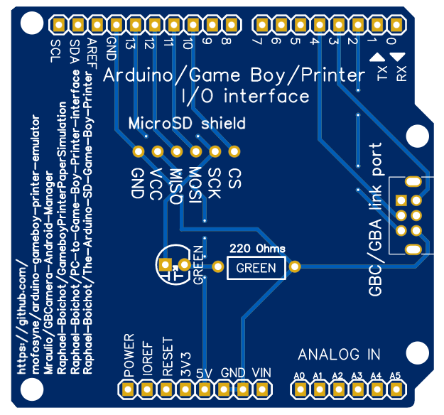

# Game Boy Printer Emulator PCB for Arduino
PCB to connect cleanly different projects around the Game Boy Printer to an Arduino : 
- [https://github.com/mofosyne/arduino-gameboy-printer-emulator](https://github.com/mofosyne/arduino-gameboy-printer-emulator)
- [https://github.com/Mraulio/GBCamera-Android-Manager](https://github.com/Mraulio/GBCamera-Android-Manager)
- [https://github.com/Raphael-Boichot/PC-to-Game-Boy-Printer-interface](https://github.com/Raphael-Boichot/PC-to-Game-Boy-Printer-interface)
- [https://github.com/Raphael-Boichot/PC-to-Game-Boy-Printer-interface](https://github.com/Raphael-Boichot/PC-to-Game-Boy-Printer-interface)

