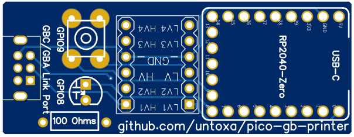

# PCBs for various Game Boy Printer emulator projects

## Why ?
Because 99.9% of the non success when building a Game Boy Printer emulator based on Arduino or Pi Pico is just inversion between SIN and SOUT, because cutting original cables is a shame, because cutting Aliexpress cables anyway requires a multimeter as you cannot trust any wire color (and ends as more or less janky designs depending on your soldering skill), here are PCBs cheap and easy to populate that avoid all these hassles.

Sidenote: if you wish to build a fully standalone emulator (without need for a decoder or a PC / phone), you can also take a look at the [TinyGB Printer](https://github.com/Raphael-Boichot/The-TinyGB-Printer) (RP2040 based) and the [NeoGB Printer](https://github.com/zenaro147/NeoGB-Printer) (ESP32 based).

## How ?
PCB designs can be edited with [EasyEDA Standard Edition](https://easyeda.com). Schematics follows the associated projects, so refer to them and to the PCB source files to get the pinout. All these boards must be used with a **GB/GBC compatible link cable**. **GBA only (purple cables) are not pinout compatible** with the proposed socket (even if they fit as the only sockets available online in 2024 are the GBA compatible version). These boards have been tested IRL with GB/GBA/GBC/GB Boy Colour (as long as the cable is GB/GBC compatible).

Eu citizens are advised to order PCBs at [JLCPCB](https://jlcpcb.com/) to avoid additional prohibitive taxes with customs (taxes paid at order). I've never had any quality issue with them. Just drop the gerber to their site and order with default parameters (the cheapest by default). Considering that you yet have very basic soldering hardware (and skill), each populated PCB should cost you about 10€ maximum. You will save a multimeter too as it will work first try.

You can modify and copy the source files or sell these PCBs bare or populated as long as you respect the license terms (in brief, cite [Raphaël BOICHOT](https://github.com/Raphael-Boichot) and [Brian KHUU](https://github.com/mofosyne)). 

Want to buy a [Retrospy Pixel](https://retro-spy.com/product/pixel-gameboy-printer/) Game Boy Printer emulator ? The product as sold is just the **exact [Arduino Printer emulator](https://github.com/mofosyne/arduino-gameboy-printer-emulator)** flashed on Arduino Nano and hidden in a 3D printed shell, with the **exact same pinout** (because yes, the license allows it as long as the author is cited, which nevertheless required a gentle reminder to the seller...). The PCBs proposed here are totally compatible for a fraction of the proposed price.

**Last but not least: some Aliexpress sellers ship Arduino nanos defective out of the bag** ("L" led flashes rapidely like if the bootloader was not installed but any attempt to update it with another Arduino or flash the board will fail), so **better test them before soldering anything**. You can flash the bare board with the printer emulator, it must at least flash briefly and return the welcome message on the serial console.

## It looks like this

(yes, it is very fancy in blue but the green had faster shipping options)

## Game Boy Printer Emulator PCB for the Arduino Nano
Arduino Nano compatible PCB to connect cleanly different projects around the Game Boy Printer: 
- [The original Game Boy Printer Emulator](https://github.com/mofosyne/arduino-gameboy-printer-emulator)
- [The GBCamera Android Manager](https://github.com/Mraulio/GBCamera-Android-Manager)
- [The direct PC to Game Boy Printer interface](https://github.com/Raphael-Boichot/PC-to-Game-Boy-Printer-interface)
- [The Game Boy Printer paper simulator](https://github.com/Raphael-Boichot/GameboyPrinterPaperSimulation)
- [The Retrospy Pixel Game Boy Printer Emulator](https://github.com/retrospy/RetroSpy)

I must admit that the Arduino Nano is particularly fancy as Game Boy Printer emulator device (cute and flashy as I like). The device works without the LED and resistor.

**Parts needed:** 
- An [Arduino Nano](https://www.aliexpress.com/item/1005006053215107.html), the cheaper the better;
- Some [GBA/GBC serial sockets](https://www.aliexpress.com/item/1005006358075502.html). Spare GBA link plugs are common while GB/GBC ones are impossible to source, both are pinout compatible for this application;
- Some [regular male pin headers](https://www.aliexpress.com/item/1005002577212594.html);
- The [custom PCB](/PCB_Arduino_Nano), any thickness, any finish, any color. Order at [JLCPCB](https://jlcpcb.com/);
- A [regular 5 mm LEDs](https://www.aliexpress.com/item/32848810276.html) and a [through hole resistor](https://www.aliexpress.com/item/32866216363.html) of about 220 Ohms (low value = high brighness).

It is advised to trim the pins as short as possible on the back side in order to get a clean finish.

## Game Boy Printer Emulator PCB for the Arduino Uno
Arduino Uno compatible PCB to connect cleanly different projects around the Game Boy Printer: 
- [The original Game Boy Printer Emulator](https://github.com/mofosyne/arduino-gameboy-printer-emulator)
- [The GBCamera Android Manager](https://github.com/Mraulio/GBCamera-Android-Manager)
- [The direct PC to Game Boy Printer interface](https://github.com/Raphael-Boichot/PC-to-Game-Boy-Printer-interface)
- [Yet another PC to Game Boy Printer interface](https://github.com/Raphael-Boichot/Yet-another-PC-to-Game-Boy-Printer-interface)
- [The Arduino SD Game Boy Printer](https://github.com/Raphael-Boichot/The-Arduino-SD-Game-Boy-Printer)
- [The Game Boy Printer paper simulator](https://github.com/Raphael-Boichot/GameboyPrinterPaperSimulation)
- [The Retrospy Pixel Game Boy Printer Emulator](https://github.com/retrospy/RetroSpy)

**Parts needed:** 
- An [Arduino Uno](https://www.aliexpress.com/item/1005002997846504.html), the cheaper the better;
- A [generic microSD shield](https://www.aliexpress.com/item/1005006059963950.html) if needed, check the pinout to match with PCB;
- Some [GBA/GBC serial sockets](https://www.aliexpress.com/item/1005006358075502.html). Spare GBA link plugs are common while GB/GBC ones are impossible to source, both are pinout compatible for this application;
- Some [male pin headers](https://www.aliexpress.com/item/1005006104110168.html). The clearance with the Arduino Uno shield is tight, but by triming pins below the PCB regular 11 mm pin headers are OK;
- The [custom PCB](/PCB_Arduino_Uno), any thickness, any finish, any color. Order at [JLCPCB](https://jlcpcb.com/);
- A [regular 5 mm LEDs](https://www.aliexpress.com/item/32848810276.html) and a [through hole resistor](https://www.aliexpress.com/item/32866216363.html) of about 220 Ohms (low value = high brighness). The device works without the LED and resistor (but is is less cool).

### For Game Boy Printer emulator and and PC to printer direct interface, without SD shield adapter

### For SD printer, with micro SD shield adapter

If you use [SD card based project](https://github.com/Raphael-Boichot/The-Arduino-SD-Game-Boy-Printer), LED will flash when SD card is accessed as it is connected to CLK. For non SD based projects, just left the SD stuff unpopulated. The "Analog in" rows of pins can also be let without pin header if you want to spare some, it is never used here. The Arduino Uno is overall the most reliable device for playing with the Game Boy/Game Boy Printer.

## Game Boy Printer Emulator PCB for the Waveshare RP2040 Zero
RP2040 compatible PCB to connect cleanly:
- [The Pico GB Printer](https://github.com/untoxa/pico-gb-printer)
- [The Pico GB Web Camera](https://github.com/untoxa/pico-gb-webcamera)
- All the GB printer Arduino projects (see the sidenote for pinout)

**Parts needed:** 
- An [Waveshare RP2040 Zero (or copy)](https://www.aliexpress.com/item/1005003504006451.html), **with pin header** (or add some);
- Some [GBA/GBC serial sockets](https://www.aliexpress.com/item/1005006358075502.html). Spare GBA link plugs are common while GB/GBC ones are impossible to source, both are pinout compatible for this application;
- A [4 gates bidirectionnal level shifters](https://www.aliexpress.com/item/1005004560297038.html). Any similar one in another seller will do the job.
- The [custom PCB](/PCB_RP2040_Zero), any thickness, any finish, any color. Order at [JLCPCB](https://jlcpcb.com/);
- A [regular 5 mm LEDs](https://www.aliexpress.com/item/32848810276.html) and a [through hole resistor](https://www.aliexpress.com/item/32866216363.html) of about 100 Ohms (low value = high brighness).
- A [6x6 push button](https://www.aliexpress.com/item/1005003938244847.html)  whatever height, that can be harvested on any dead electronic suff so it is common.

It is advised to trim the pins as short as possible on the back side in order to get a clean finish.

For full support with the **pico-gb-printer**, just drop the [last compiled uf2 rom](/PCB_RP2040_Zero/pico_gb_printer.uf2) to your Pi Pico. This is a version recompiled from the source that supports led and tear button of the current PCB.

**Sidenotes:**
This board is also compatible with the Arduino based projects if you compile them with the [Earle Philhower RP2040 core](https://github.com/earlephilhower/arduino-pico) installed on Arduino IDE. Just route [LED_STATUS_PIN to pin 8 instead of 13](https://github.com/mofosyne/arduino-gameboy-printer-emulator/blob/30b91fd60cae8a97a446764cba289b109bcb47d4/GameBoyPrinterEmulator/GameBoyPrinterEmulator.ino#L88) and [GBP_SO_PIN to 0 instead of 4](https://github.com/mofosyne/arduino-gameboy-printer-emulator/blob/30b91fd60cae8a97a446764cba289b109bcb47d4/GameBoyPrinterEmulator/GameBoyPrinterEmulator.ino#L83). Due to the way the Pico hard resets the serial connection contrary to the Arduino in case of reboot, some automated parsers may have compatibility issues but it overall works using PuTTy for example.

The Waveshare RP2040 Zero is also equipped with a fancy WS2812 as internal LED which is not driven in the projects linked here, sadly. It's up to you to code a basic controller for it (like in the picture above).

I won't provide any PCB compatible with the Stackmashing's USB to GB Link Cable Adapter as [there are some on Github](https://github.com/agtbaskara/game-boy-pico-link-board) and you can always recompile the codes if needed (good luck !). Do not ask me why the Pico GB printer and the Stackmashing's board are not directly compatible (they do not share the same pinout while being **totally similar** in function), I have no idea, I'm not author of any of these projects.
